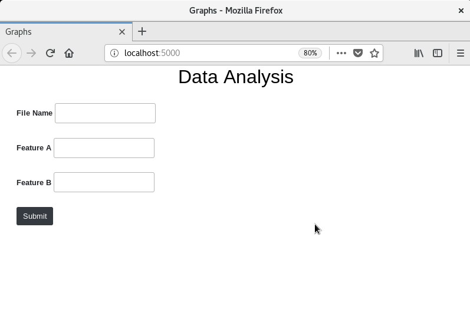
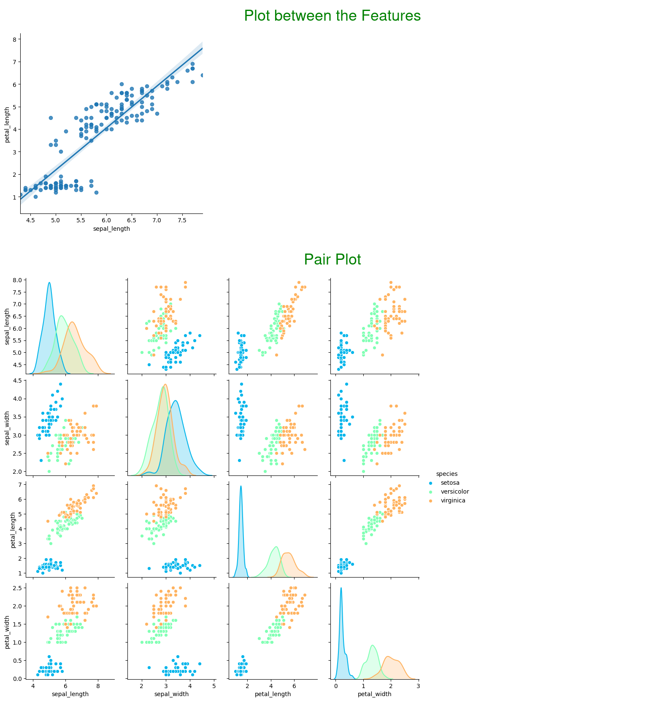

# Docker-Project
A small project which uses Flask, docker and seaborn for Data Visualization

## Setup

### 1. [Install Docker Engine](https://docs.docker.com/engine/install/)

### 2. Launch Docker Container
   In this project centos7 is used as the OS for docker container, So the below commands will work without any changes but if you are using any other OS then use the respective commands.
  
### 3. Install dependencies
   The system has the following package requirements:
  * python3 >= 3.6  
     ```
     yum install -y python3
     ```    
  * pip
     ```
     yum install -y python36u-pip
     ```      
  * aniso8601, click, Flask, Flask-RESTful, itsdangerous, Jinja2, MarkupSafe, pytz, six, Werkzeug, numpy, pandas, seaborn 
     ```
     pip3.6 install -r requirements.txt
     ```      

## Deployment
  * Pull the repository inside the root folder and change the folder name containing the code to Flask_app
  * Inside root/.bashrc write python3.6 /root/Flask_app/app.py . So when we launch the container this will start the webserver
  * -v is used to attach the persistent storage Flask_APP to the Flask_app directory inside the container
  * For accessing the website from outside the container enable patting(-p 5000:5000)   
#### run: docker run -itd --name webserver -p 5000:5000 -v Flask_APP:/root/Flask_app eda_docker:v1
  
## Built With

* [Flask](https://flask.palletsprojects.com/en/1.1.x/) - Web framework
* [Docker](https://www.docker.com/) - Used for Containerization
* [Seaborn](https://seaborn.pydata.org/) - Used to generate the Plots


## Screenshots


